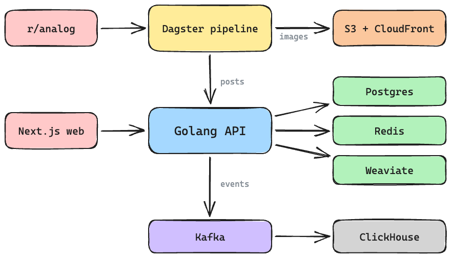

# AnalogDB

The collection of film photography

### About

[AnalogDB](https://analogdb.com) is a curated collection of 20k+ analog photographs, served through a REST API. Beyond just returning photos, AnalogDB tags each image with the camera and film it was shot on, finds visually similar images, adds keyword labels, extracts dominant colors, and allows for filtering, sorting and searching across the whole collection.

### Design

AnalogDB makes use of several technologies and services to enable a full featured product.


<br/><br/>

Data is scraped from r/analog with [praw](https://github.com/praw-dev/praw) and run through a pipeline orchestrated by [Dagster](https://github.com/dagster-io/dagster). Along the way an LLM reads each post title to pull out the camera, film and lens, images are resized, and keywords and dominant colors are extracted. Images are uploaded to [AWS S3](https://aws.amazon.com/s3/) and served from [CloudFront CDN](https://aws.amazon.com/cloudfront/) for quick and reliable delivery, and posts are created through the backend API with a generated Python client. Scheduled jobs keep scores and keywords fresh over time.

The core backend application is written in Go and makes use of [chi](https://github.com/go-chi/chi) as the HTTP router. It exposes versioned handlers under `/v1` that are responsible for parsing authentication headers, filtering incoming requests, querying databases, and returning JSON responses. Posts live in PostgreSQL, with [Redis](https://github.com/redis/redis) caching hot responses. Upon upload, all images are transformed with the [ResNet-50 CNN](https://datagen.tech/guides/computer-vision/resnet-50/) to create embeddings which are stored in a [Weaviate](https://github.com/weaviate/weaviate) vector database for similarity search. The backend is packaged as several docker containers and hosted on a VPS.

The frontend web application is built with [Next.js](https://github.com/vercel/next.js/) using the App Router, with server-side rendering for quick loading pages. Components come from [Mantine](https://github.com/mantinedev/mantine) and styles are written with [CSS Modules](https://github.com/css-modules/css-modules). It talks to the backend through a TypeScript client generated from the OpenAPI spec.

The backend also publishes analytics events to [Kafka](https://github.com/apache/kafka). A small Go consumer reads them off the topic and writes them into [ClickHouse](https://github.com/ClickHouse/ClickHouse) for querying later. Everything is instrumented with OpenTelemetry, with traces in Tempo, logs in Loki and metrics in Prometheus, all viewed through Grafana.

### API

Full documentation for the API: <https://api.analogdb.com/>

### Example

```bash
curl "https://api.analogdb.com/v1/posts?page_size=1"
```

```json
{
  "meta": {
    "total_posts": 23403,
    "page_size": 1,
    "next_cursor": "eyJzIjoidGltZSIsInYiOjE3OTA3OTkzMTgsImlkIjo0MDEwOH0",
    "next_page_url": "/posts?cursor=eyJzIjoidGltZSIsInYiOjE3OTA3OTkzMTgsImlkIjo0MDEwOH0&page_size=1&sort=time"
  },
  "posts": [
    {
      "id": 40108,
      "title": "Coney [EOS1 + 24-70 + Ektacolor Pro 800]",
      "author": "jaironaut",
      "permalink": "https://www.reddit.com/r/analog/comments/1wufjt5/coney_eos1_2470_ektacolor_pro_800/",
      "score": 945,
      "timestamp": 1790799318,
      "nsfw": false,
      "grayscale": false,
      "sprocket": false,
      "camera_make": "canon",
      "camera_model": "eos 1",
      "film_make": "kodak",
      "film_speed": 800,
      "focal_length": 24,
      "images": [
        {
          "resolution": "low",
          "url": "https://d3i73ktnzbi69i.cloudfront.net/0cb48c8168dc5f67395fcdb4-low.jpeg",
          "width": 480,
          "height": 720
        },
        {
          "resolution": "medium",
          "url": "https://d3i73ktnzbi69i.cloudfront.net/0cb48c8168dc5f67395fcdb4-medium.jpeg",
          "width": 720,
          "height": 1080
        }
      ],
      "colors": [
        {
          "hex": "#020202",
          "css": "black",
          "html": "black",
          "percent": 0.25280361
        },
        {
          "hex": "#e9d9a8",
          "css": "palegoldenrod",
          "html": "gray",
          "percent": 0.20223035
        }
      ],
      "keywords": [
        { "word": "coney", "weight": 0.3200431 },
        { "word": "eos1", "weight": 0.3200431 }
      ]
    }
  ]
}
```

The response has been truncated here, real posts come with four image sizes, five colors and more keywords.

### Deploying

There are prebuilt docker images on Docker Hub:

- `evanofslack/analogdb` for the backend API
- `evanofslack/analogdb-web` for the frontend
- `evanofslack/analogdb-dagster` for the scraping pipeline
- `evanofslack/analogdb-consumer` for the analytics consumer

Each service has its own `docker-compose.yaml` (in [backend](backend/docker-compose.yaml), [web](web/docker-compose.yaml), [scrape](scrape/docker-compose.yaml) and [consumer](consumer/docker-compose.yaml)) with the necessary variables and services for an example deployment.

### Developing

Tasks run through [just](https://github.com/casey/just), and running `just` on its own lists every recipe.

To set up the docker network and install dependencies:

`just setup`

To spin up the backend, consumer, web and infra containers:

`just up`

To run all the tests:

`just test`

To serve the frontend locally:

`just web dev`

To run the Dagster pipeline locally:

`just scrape dev`

### Contributing

All contributions are welcomed and encouraged. Please create a new issue to discuss potential improvements or submit a pull request.
